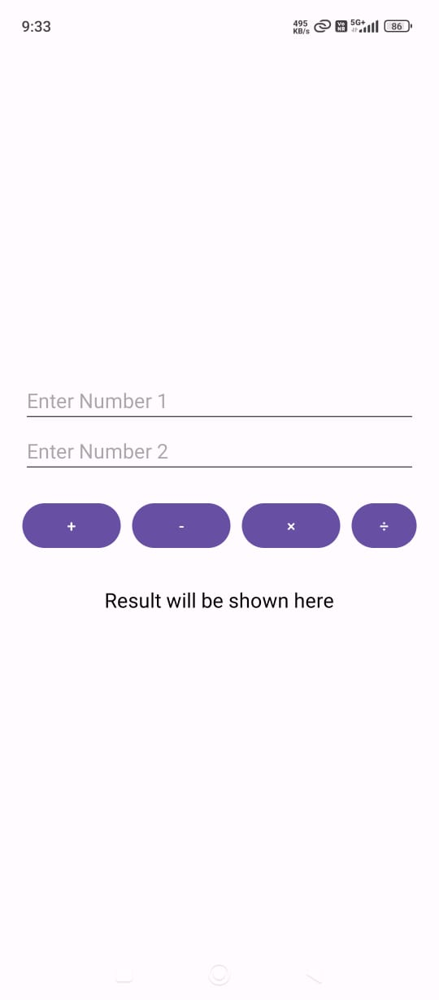
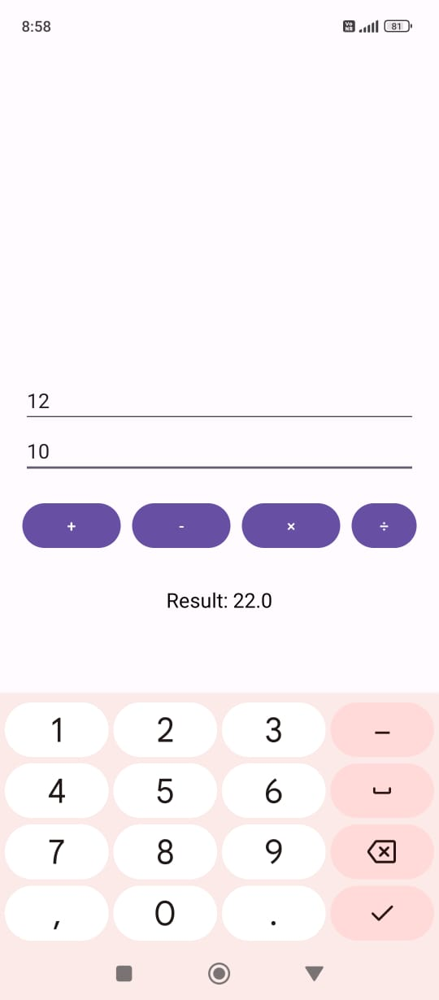
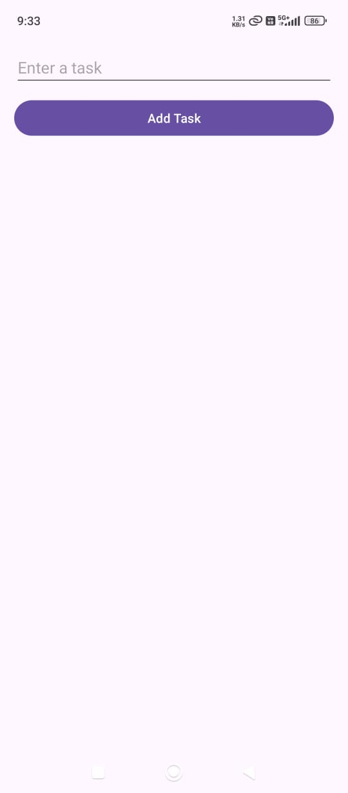
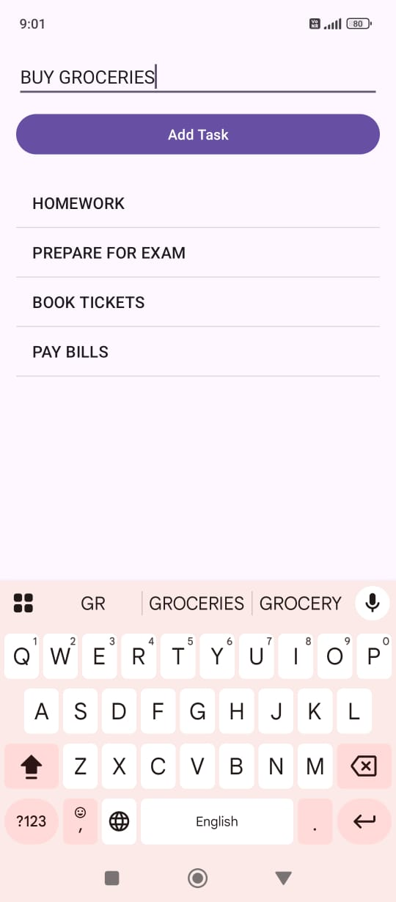

# 📱Android App

This are a simple and clean Android application developed using Java and Android Studio.  
It serves as a practical project for learning and showcasing Android app development skills.

---

## ✨ Features

- 🧮 Calculator with basic operations 
- ✅ To-Do List with task tracking 
- 🌦️ Weather App using OpenWeatherMap API 
- 💡 Dark mode support

---

## 📸 Screenshots

| Home Screen | Features |
|-------------|----------|
|  |  |

---

## 📸 Screenshots

| Home Screen | Features |
|-------------|----------|
|  |  |

---

## 📸 Screenshots

| Home Screen | Features |
|-------------|----------|
|  |  |

---

## 🛠️ Tech Stack

- Java
- Android Studio
- XML for UI
- [OpenWeatherMap API](https://openweathermap.org/)
- Git + GitHub for version control

---

## 🚀 Getting Started

### Prerequisites

- Android Studio installed
- Android device or emulator (API level 21 or higher)

### Clone the Repository

```bash
git clone https://github.com/Bharathwaj1209/My_Android_Projects.git
